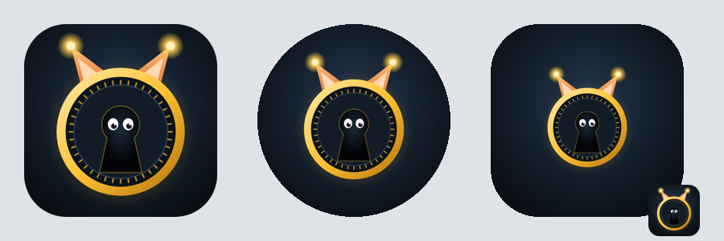

# Escapator

Escape game pour smartphone Android : 4 missions, 12 épisodes, 40 verrous mêlant capteurs du téléphone et énigmes classiques, avec Oki, le guide renard-lynx. Interface FR / EN / RU (mots à trouver en français), jeu solo ou en équipe de 2 à 6.



## Arborescence
```
escapator/
├─ docs/                      Application web (servie par GitHub Pages, embarquée dans l'APK)
│  ├─ index.html              Jeu complet (HTML/CSS/JS en un fichier)
│  ├─ manifest.json, sw.js    PWA installable et hors ligne
│  ├─ icon.svg, icon-*.png    Icônes (standard et maskable)
│  └─ .nojekyll
├─ native/                    Code Android ajouté à l'APK
│  ├─ SensorsPlugin.java      Baromètre, proximité, lumière, magnétomètre, torche, NFC,
│  │                          vibreur, synthèse vocale, partage, écran allumé, batterie
│  ├─ MainActivity.java       Enregistrement du plugin
│  └─ patch-manifest.js       Permissions Android + orientation portrait
├─ assets/                    Sources icône et écran de démarrage de l'APK
├─ captures/                  Aperçus des écrans
├─ .github/workflows/android.yml   Compilation automatique de l'APK
├─ capacitor.config.json, package.json, .gitignore
```

## Mise en ligne
1. Créer un dépôt GitHub et y déposer le contenu du dossier `escapator/`.
2. **Version web** : Settings > Pages > Deploy from branch > `main` / `/docs`. Ouvrir `https://<compte>.github.io/<depot>/` sur le téléphone (HTTPS requis pour les capteurs), puis « Ajouter à l'écran d'accueil ».
3. **Application Android** : chaque push sur `main` (ou `master`) compile l'APK dans l'onglet **Actions** (environ 5 min). Il est ensuite téléchargeable dans **Releases > Escapator (dernière version) > escapator.apk**. Un tag `v1.0.0` crée en plus une version numérotée. Installer en autorisant les sources inconnues.
   - Le dossier caché `.github/` doit être présent dans le dépôt : sans lui, aucune compilation n'est lancée. En dépôt par glisser-déposer, il est souvent ignoré ; le créer alors via *Add file > Create new file* avec le chemin `.github/workflows/android.yml`.

Build local (JDK 21, Android SDK) : `npm install`, `npm run android:init`, `npm run android:build`.

## Missions et épisodes
Chaque mission alterne 6 verrous capteurs (lettres du mot) et 4 énigmes classiques (chiffres du code maître).

| Mission | Durée | Épisodes (mot à trouver) |
|---|---|---|
| Protocole Oméga (labo) | 60 min | Code Oméga (LIBRES), La souche X-17 (REMEDE), La serre interdite (RACINE) |
| Opération Kraken (sous-marin) | 55 min | Profondeur 300 (RIVAGE), Le trésor englouti (PERLES), La sonde perdue (ABYSSE) |
| Le Casse (banque) | 50 min | Le coup du siècle (TRESOR), Les joyaux de la couronne (JOYAUX), Le coupable idéal (PREUVE) |
| Expédition Zénith (extérieur) | 75 min | Atterrissage forcé (ETOILE), Premier contact (AMITIE), Fenêtre de tir (ORBITE) |

Verrous capteurs : gyroscope, inclinaison, accéléromètre, vibreur, micro, lumière, caméra, magnétomètre, baromètre, proximité, lampe torche, sonar, multitouch, NFC, boussole, GPS, analyse de fréquence, réalité augmentée.
Énigmes classiques : César, morse, équations à symboles, suites, carré magique, Mastermind, Lights Out, nonogramme, taquin. Codes et grilles régénérés à chaque partie.

## Jeu en équipe
Rôles 📱 Pilote, 🧠 Décodeur, 🗒️ Archiviste, 👂 Observateur, ⏱️ Stratège, répartis selon le nombre de joueurs, avec rotation optionnelle. Tout le monde joue le même verrou ; l'écran « Passe le téléphone à… » ne démarre le verrou qu'une fois le téléphone en main.

## Paramètres d'URL (web)
| Paramètre | Effet |
|---|---|
| `min=30` | Durée imposée |
| `lat=..&lng=..&r=20` | Point GPS fixe (Zénith) |
| `debug` | Bouton « Forcer » sur chaque verrou |

## Compatibilité
| Fonction | APK | Web (Chrome Android) |
|---|---|---|
| Baromètre, proximité, lumière | Natif | Proximité et lumière via caméra, baromètre forçable |
| Magnétomètre | Natif | Flag `chrome://flags/#enable-generic-sensor-extra-classes`, sinon boussole |
| Lampe torche / NFC | Natif | Flash de l'écran / Web NFC (tags NDEF) |
| Voix d'Oki | TTS Android | Web Speech |

Capteur absent : le verrou peut être forcé contre 5 minutes.

## Écran, batterie, animations
- Écran maintenu allumé uniquement pendant une mission.
- En arrière-plan : capteurs, caméra, micro, sons coupés ; reprise automatique au retour.
- Mode économie (🔋 du bandeau, automatique sous 20 %) : fond figé, animations et ambiance coupées.
- Transitions animées entre écrans et cinématiques (lancement, verrou maître, victoire, échec), désactivées en mode économie ou si le téléphone demande de réduire les animations.
